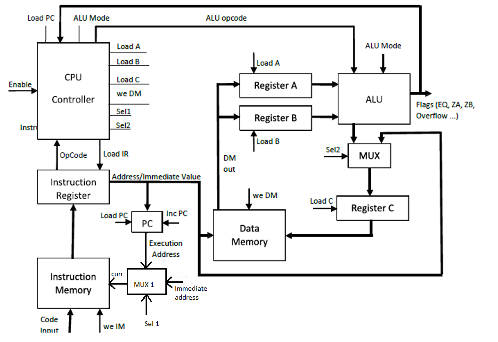

# N-Bit-CPU-using-Verilog
Design of a N-Bit CPU using Verilog

----
# Requirements
  

---
## Approach
To achieve a N-Bit CPU design, we had to start by designing the individual components.
The components used were:
1. ALU
2. Arithmetic Unit
3. Logic Unit
5. Data Memory
6. Instruction memory
7. Program Counter
8. Instruction Register
9. Multiplexer
10. Controller
11. CPU
12. Common Register
------

## The Instruction Set

The instruction set plays a very important role to determine the operation of the CPU. The Code input to the Instruction memory is N-bit long. This is sent to the instruction register which takes the bits [N-1:N-4] as OPCODE and [N-5:0] as address to start with.

The instruction set are designed in a way to achieve all the necessary functions. Since the OPCODE controls the activity, the OPCODE is used as described below.

The last bit of the code input acts as a mode selection for ALU. Remaining 4 bits are used for the ALU operation.

0000 - Mode 1, Arithmetic Unit for ADD

0001 - Mode 1, Arithmetic Unit for Subtract

0010 - Mode 1, Arithmetic Unit for Increase

0011 - Mode 1, Arithmetic Unit for Decrease

0100 - Mode 1, Arithmetic Unit for Shift Left

0101 - Mode 1, Arithmetic Unit for Shift Right

0111 - mode 0, Logic Unit for Comparision

1000 - mode 0, Logic Unit for AND 

1001 - mode 0, Logic Unit for OR

1010 - mode 0, Logic Unit for XOR

1011 - mode 0, Logic Unit for NOT
------

## Flow

The Design is completed using a state machine approach. Three states are used to monitor the action of CPU. The three states used are reset, load and execute.

In reset state, we initializa all address to base address and code input to 0. All the signals going out from controller are 0.

In the load state, we initialise the Instruction register with the address and OPCODE to make sure the design is ready for execution.

In execute state, we provide the function required by the USER based in the Instruction set provided.

----

## CODE

The code for the entire design is provided in the folder. The codes have been executed and checked for proper funtioning.
